# Pervasive Displays Library Suite - Basic edition for EXT4 and EPDK-Matter

   

 

The Pervasive Displays Library Suite is specifically designed for the [Pervasive Displays](https://www.pervasivedisplays.com) e-paper screens, extension boards and evaluation kits.

> ### The library **PDLS_EXT4_Basic_Matter** turns legacy. 
>
> As a replacement, use the [PDLS_Basic](https://github.com/rei-vilo/PDLS_Basic) library, with dedicated examples for the [EXT4](https://github.com/rei-vilo/PDLS_Basic/tree/main/examples/EXT4) and [EPDK-Matter](https://github.com/rei-vilo/PDLS_Basic/tree/main/examples/EXT4_Matter).

The **PDLS\_EXT4\_Basic\_Matter** library supports the screens

* iTC [monochrome screens with wide temperature and embedded fast update](https://www.pervasivedisplays.com/products/?_sft_etc_itc=pu&_sft_temperature_range=m15c-to-p60c) (film `K`), up to 2.9";

<!-- 
  
 -->

the boards

* Pervasive Displays [EPD Extension Kit Gen 4 (EXT4)](https://www.pervasivedisplays.com/product/epd-extension-kit-gen-4-EXT4/), 
* Pervasive Displays EXT4-to-Nano adapter;

and the kit

*  [E-Paper Development Kit for Matter (EPDK-Matter)](https://www.pervasivedisplays.com), which includes a Pervasive Displays [EPD Extension Kit Gen 4 (EXT4)](https://www.pervasivedisplays.com/product/epd-extension-kit-gen-3-EXT3/) and a Pervasive Displays EXT4-to-Nano adapter boards, a Pervasive Displays [2.9″ 384x168 E-ink monochrome high-definition](https://www.pervasivedisplays.com/product/2-9-e-ink-displays/) with embedded fast update and wide temperature display, an [Arduino Nano Matter](https://store.arduino.cc/pages/nano-matter) board based on [Silicon Labs MGM240S](https://www.silabs.com/wireless/zigbee/efr32mg24-series-2-modules).

The library has also been tested successfully against the [Silicon Labs EFR32xG24 Explorer Kit](https://www.silabs.com/development-tools/wireless/efr32xg24-explorer-kit) board.

## Features

The Pervasive Displays Library Suite provides a high-level interface to drive the e-paper screens.

* Fast update
* Graphics routines
* Text routines
* Four extended fonts with double-sized variants
* Access to sensors interrupt signals

## Documentation

* [Knowledge Base](https://docs.pervasivedisplays.com/knwoledge/)

## Support

* Please refer to [PDLS_EXT3_Basic_Global](https://github.com/rei-vilo/PDLS_EXT3_Basic_Global/issues) for reporting issues and contributing pull requests.

## Hardware

### EXT4

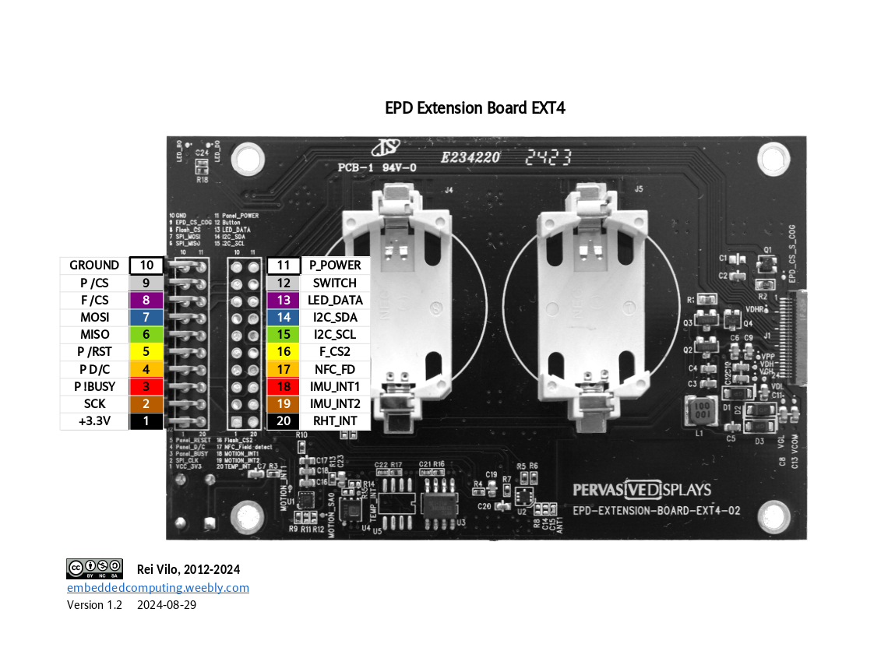

### Connection to Arduino Nano Matter

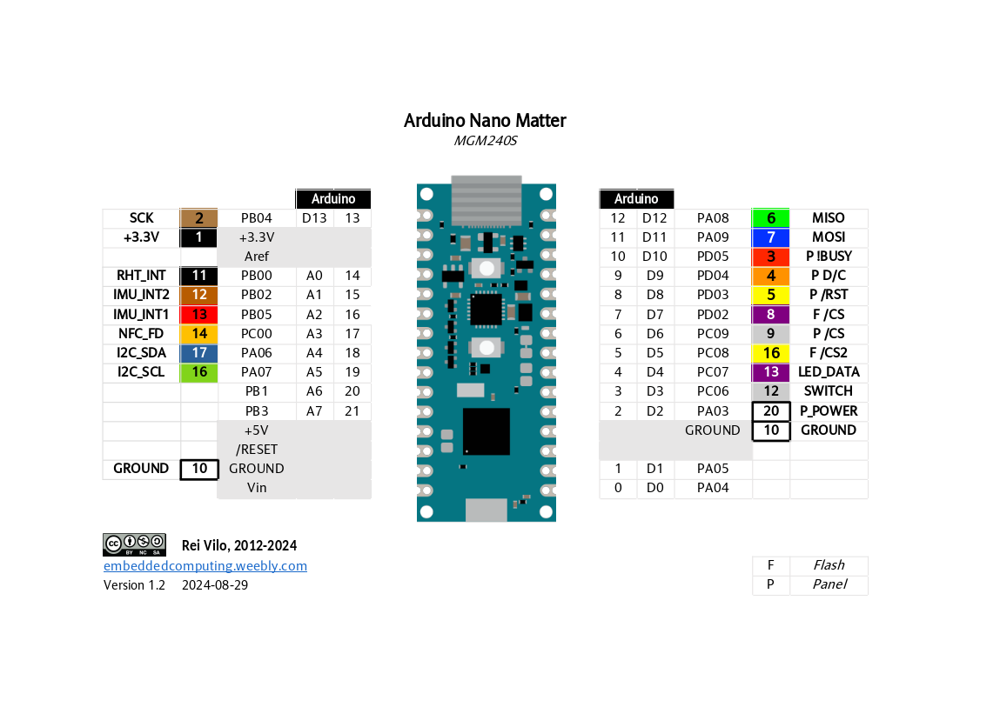
<!-- 
### Connection to SiLabs xG24 Explorer Kit

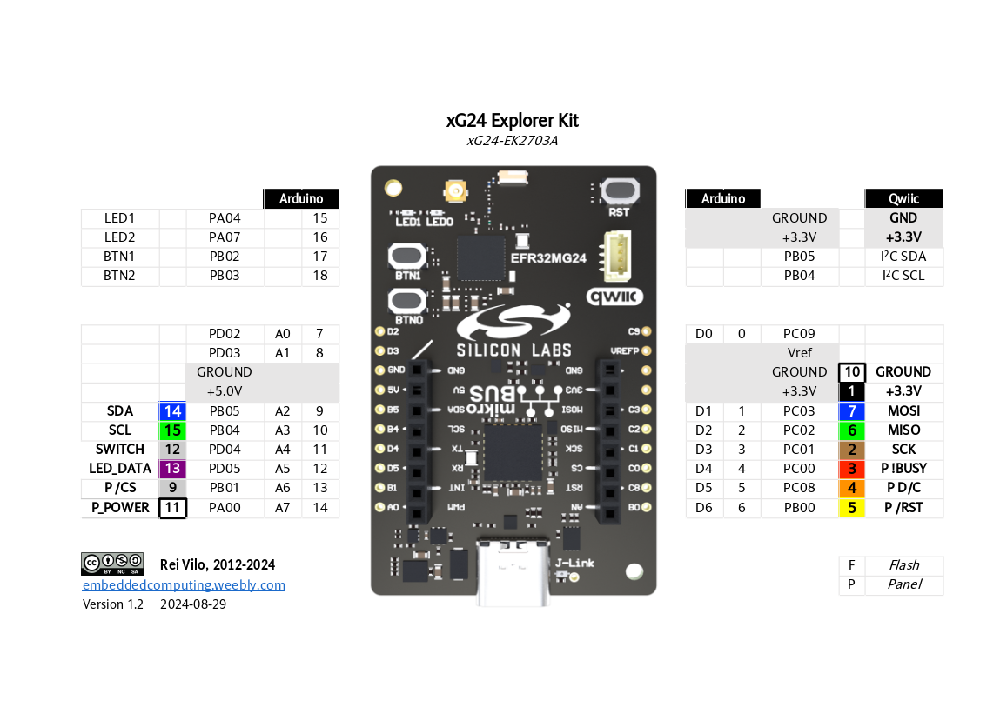 -->

## Software

### EXT4 sensors examples

Accelerometer-based orientation | Double-sized fonts
--- | ---
 | 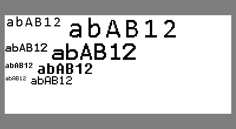

### EXT4 Matter examples

Matter commissioning | Matter connection
--- | ---
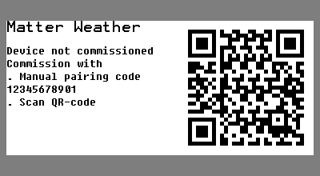 | 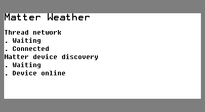

Weather sensor | RGB bulb
--- | ---
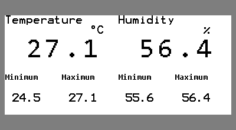 | 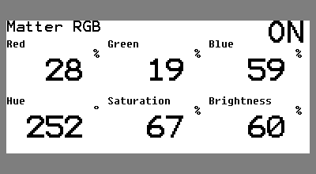

One-button menu | About
--- | ---
 | 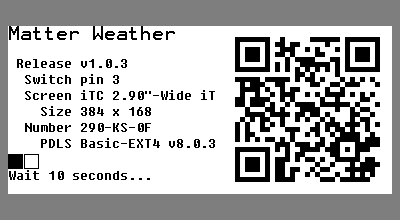

### EXT4 screen sizes example

The EXT4 extension board and the `PDLS_EXT4_Basic_Matter` library support the monochrome screens with wide temperature and embedded fast update (film `K`) up to 2.90".

1.52" | 2.06"
--- | ---
 | 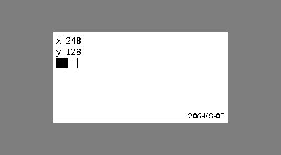 

2.13" | 2.66"
--- | ---
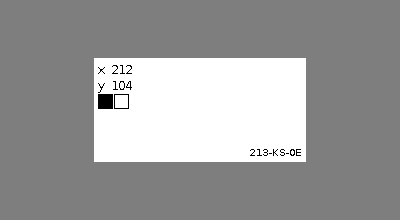 |  

2.71" | 2.90"
--- | ---
 | 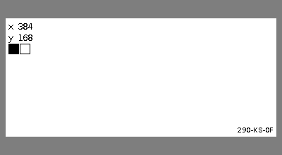

## Examples

### Common examples

* Common_Colours
* Common_Fonts
* Common_Forms
* Common_Orientation
* Common_Persistent
* Common_Text
* Common_WhoAmI

### Fast update examples

* Example_Fast_Line
* Example_Fast_Orientation
* Example_Fast_Speed

### EXT4 sensors examples

* EXT4_WhoAmI
* EXT4_ScreenSizes
* EXT4_LargeFont
* EXT4_Accelerometer
* EXT4_Weather
* EXT4_WS2813C

### EXT4 Matter examples 
 
* EXT4_Matter_RGB 
* EXT4_Matter_Weather 

## Installation

Software

* [Arduino IDE](https://www.arduino.cc/en/software) or [Arduino CLI](https://arduino.github.io/arduino-cli/)
* [Installing Additional Arduino Libraries](https://www.arduino.cc/en/guide/libraries)

    + Using the Library Manager
    + Importing a `.zip` Library

Hardware

* [Connecting the Pervasive Displays e-Paper EPD Extension Kit Gen 4](https://embeddedcomputing.weebly.com/connecting-the-pervasive-displays-ext4.html)

## Configuration

Software

* Arduino SDK
* SPI library
* Wire library
* [QRCode library](https://www.arduino.cc/reference/en/libraries/qrcode/) to generate the QR-codes
* [Silicon Labs Arduino Core](https://github.com/siliconlabs/arduino) release `2.2.0` or later

Hardware

* Pervasive Displays EPD Extension Kit Gen 4 (EXT4)
* Pervasive Displays E-Paper Development Kit for Matter (EPDK-Matter) with Arduino Nano Matter

## Licence

**Copyright** &copy; Pervasive Displays Inc., 2021-2025, under licence by Rei Vilo

*For exclusive use with Pervasive Displays screens*

**Portions** &copy; Pervasive Displays, Silicon Laboratories Inc., Arduino, 2010-2025

**Licence** [Attribution-ShareAlike 4.0 International (CC BY-SA 4.0)](./LICENCE.md)

**Copyright** &copy; Rei Vilo, 2010-2025

